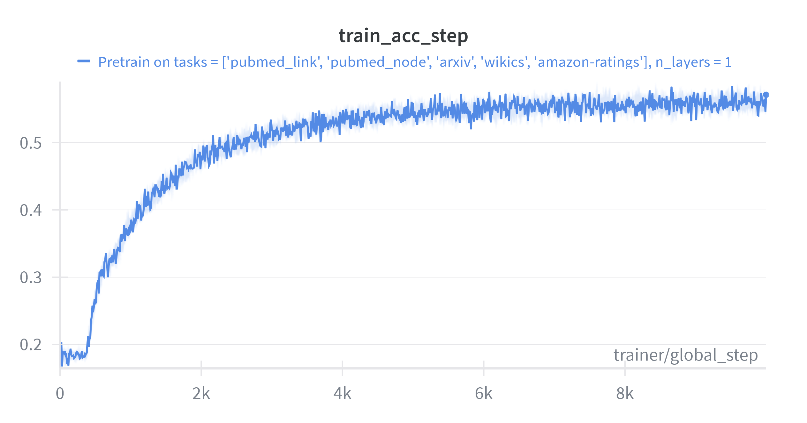
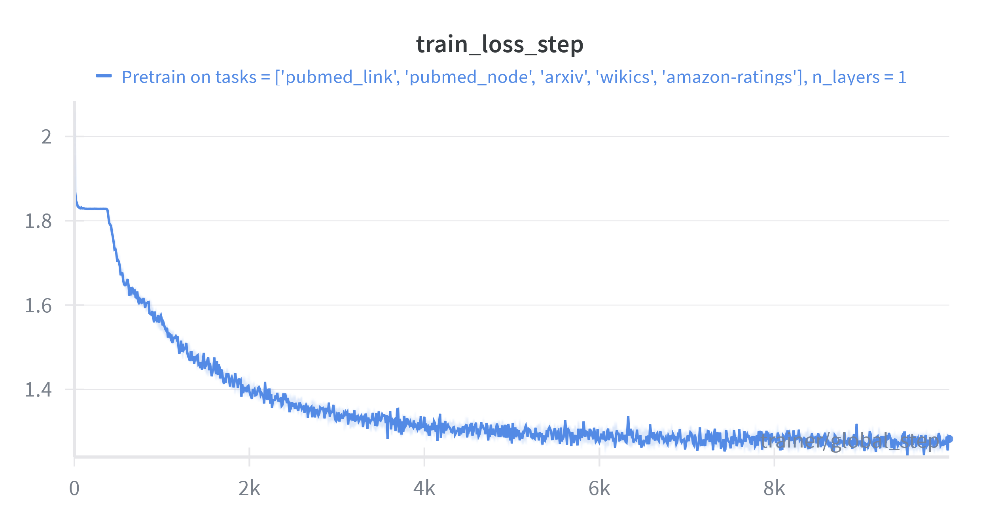
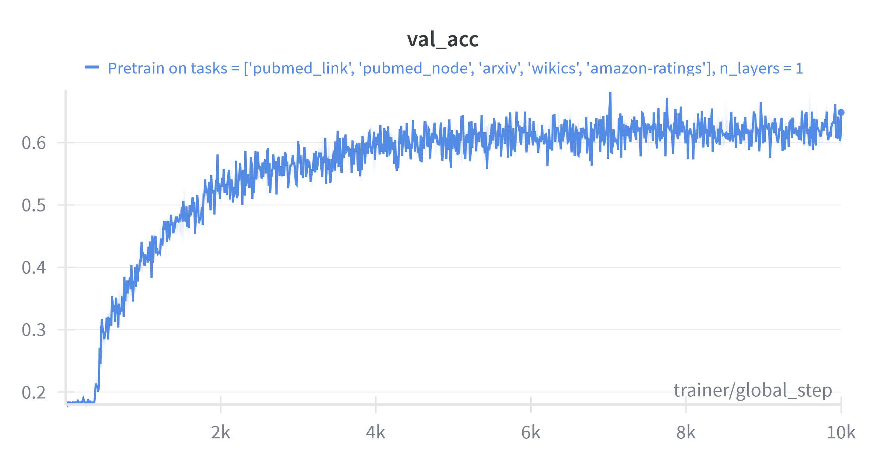

<div align=center>

# *Modality-Free Graph In-Context Alignment*

</div>

## Environment Preparation ##

```
conda create -n MF-GIA python=3.12.2
conda activate MF-GIA

pip install -r requirements.txt
```

## Data Preparation ##

We use the arxiv, wikiCS, PubMed and Amazon-ratings to pretrain the model. For arxiv dataset, users should copy the raw data ``arxiv_CS_categories.txt``, ``labelidx2arxivcategeory.csv.gz`` and ``nodeidx2paperid.csv.gz`` into the directory ``datasets/ofa/SingleTextGraph.arxiv``. For WikiCS, the raw data ``metadata.json`` should be stored in ``datasets/pyg/SingleTextGraph.WikiCS``. All raw data are provided by [OFA](https://github.com/LechengKong/OneForAll/tree/main/data). Please download them and organize the ``datasets/`` directory as follows:

```
datasets/
├── ofa
│   ├── SingleTextGraph.arxiv
│   │   ├── arxiv_CS_categories.txt
│   │   ├── labelidx2arxivcategeory.csv.gz
│   │   ├── nodeidx2paperid.csv.gz
│   │   ├── ogbn_arxiv
│   │   │   ├── mapping
│   │   │   │   ├── labelidx2arxivcategeory.csv.gz
│   │   │   │   ├── nodeidx2paperid.csv.gz
│   │   │   │   └── README.md
│   │   │   ├── processed
│   │   │   │   ├── geometric_data_processed.pt
│   │   │   │   ├── pre_filter.pt
│   │   │   │   └── pre_transform.pt
│   │   │   ├── raw
│   │   │   │   ├── edge.csv.gz
│   │   │   │   ├── node-feat.csv.gz
│   │   │   │   ├── node-label.csv.gz
│   │   │   │   ├── node_year.csv.gz
│   │   │   │   ├── num-edge-list.csv.gz
│   │   │   │   └── num-node-list.csv.gz
│   │   │   ├── RELEASE_v1.txt
│   │   │   └── split
│   │   │       └── time
│   │   │           ├── test.csv.gz
│   │   │           ├── train.csv.gz
│   │   │           └── valid.csv.gz
│   │   ├── processed
│   │   │   ├── data.pt
│   │   │   ├── geometric_data_processed.pt
│   │   │   ├── pca_64.pt
│   │   │   ├── pre_filter.pt
│   │   │   ├── pre_transform.pt
│   │   │   └── texts.pkl
│   │   └── raw
│   └── SingleTextGraph.WikiCS
│       ├── metadata.json
│       ├── processed
│       │   ├── data.pt
│       │   ├── data_undirected.pt
│       │   ├── geometric_data_processed.pt
│       │   ├── pca_64.pt
│       │   ├── pre_filter.pt
│       │   ├── pre_transform.pt
│       │   └── texts.pkl
│       └── raw
│           └── data.json
└── pyg
    └── Planetoid.PubMed
        ├── processed
        │   ├── data.pt
        │   ├── pca_64.pt
        │   ├── pre_filter.pt
        │   └── pre_transform.pt
        ├── PubMed
        │   ├── processed
        │   │   ├── data.pt
        │   │   ├── pre_filter.pt
        │   │   └── pre_transform.pt
        │   └── raw
        │       ├── ind.pubmed.allx
        │       ├── ind.pubmed.ally
        │       ├── ind.pubmed.graph
        │       ├── ind.pubmed.test.index
        │       ├── ind.pubmed.tx
        │       ├── ind.pubmed.ty
        │       ├── ind.pubmed.x
        │       └── ind.pubmed.y
        └── raw
```

## Pre-training ##

To execute the pretraining process, you can directly run:

```bash
python pretrain.py
```

To configure your environment, you can modify the configuration files under ``configs/``. For example, you may change the GPU id by ``gpu: 0 ``. Note that some configuration items were not used in the project.

```yaml
pretrain:
  seed: 42
  gpu: 1
  pretrain_datasets: ['pubmed', 'arxiv', 'wikics', 'amazon-ratings']
  train_tasks: ['pubmed','arxiv','wikics', 'amazon-ratings']
  use_original_mask: false
  pretrain_epochs: 8000
```

**Additional Remarks**

If your OS/session limit for open files is low, the following error may occurs: ``untimeError: unable to open shared memory object in read-write mode: Too many open files``. Under the circumstances, you can directly decrease the ``num_workers`` to 0 in ``pt_model.py`` as:

```
def train_dataloader(self):
    return DataLoader(self.train_ds, batch_size=self.batch_size, shuffle=False, 
                        num_workers=0, pin_memory=True, collate_fn= lambda x: x)

def val_dataloader(self):
    return DataLoader(self.val_ds, batch_size=self.batch_size, shuffle=False,
                        num_workers=0, pin_memory=True, collate_fn= lambda x: x)

def test_dataloader(self):
    return DataLoader(self.test_ds, batch_size=self.batch_size, shuffle=False,
                        num_workers=0, pin_memory=True, collate_fn= lambda x: x)
```

We pre-trained our model on both Tesla V100 and RTX A5000 GPUs. The optimal learning rate and weight decay vary slightly by hardware. You can set these values in ``configs/model.yaml``:

**Tesla V100**

```yaml
PTModel:
  lr: 0.01   
  weight_decay: 0.00005
```

**RTX A5000**

```yaml
PTModel:
  lr: 5e-3  
  weight_decay: 0.0005  
```

> Notes: These values worked best for our setups. If you change batch size or optimizer settings, you may need to retune (e.g., scale the learning rate roughly with the effective batch size).

The training curve of the model monitored by wandb is as follows under A5000 GPU:

|  |  |  |
| :-----------------------------------------: | :-----------------------------------------: | :--------------------------: |

## Evaluation ##

### Checkpoints ###

We provide both the pre-trained checkpoints in the ``generated_files/checkpoints/``, and you can specify one of them to evaluate the downstream datasets:

```bash
python run_ICL_node.py --dataset ${dataset_name} --k_shot ${k_shot} --model_path generated_files/output/G-Align/Aug13-0:14-97cc0c8c/final_gfm_model.pt
```

or

```bash
python run_ICL_node.py --dataset ${dataset_name} --k_shot ${k_shot} --model_path generated_files/output/G-Align/Aug26-22:08-711a96fc/final_gfm_model.pt
```

### In-Context node classification ###

To reproduce the reported results, run:

**Cora**

```bash
# k_shot = {1,3,5}
python run_ICL_node.py --dataset cora --k_shot ${k_shot}
```

**Computers**

```bash
# k_shot = {1,3}
python run_ICL_node.py --dataset computers --k_shot ${k_shot} --norm_feat
# k_shot = 5
python run_ICL_node.py --dataset computers --k_shot ${k_shot}
```

**ogbn-Products**

```bash
# k_shot = {1,3,5}
python run_ICL_node.py --dataset ogbn-products --k_shot ${k_shot}
```

**Physics**

```bash
# k_shot = {1,3,5}
python run_ICL_node.py --dataset physics --k_shot ${k_shot}
```

**BlogCatalog**

```bash
# k_shot = {1,3,5}
python run_ICL_node.py --dataset blogcatalog --k_shot ${k_shot}
```

### In-Context link classification ###

**FB15K237**

```bash
# k_shot = {1,3,5}
# m_way = {5,10,40}
python run_ICL_link.py link_cls.dataset=fb15k237 link_cls.k_shot=${k_shot} link_cls.m_way=${m_way}
```

**WN18RR**

```bash
# k_shot = {1,3,5}
# m_way = {5,10}
python run_ICL_link.py link_cls.dataset=wn18rr link_cls.k_shot=${k_shot} link_cls.m_way=${m_way}
```
